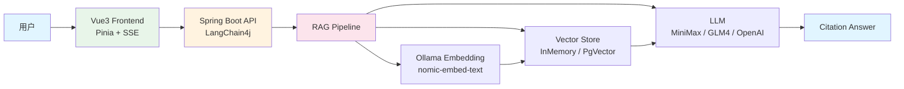
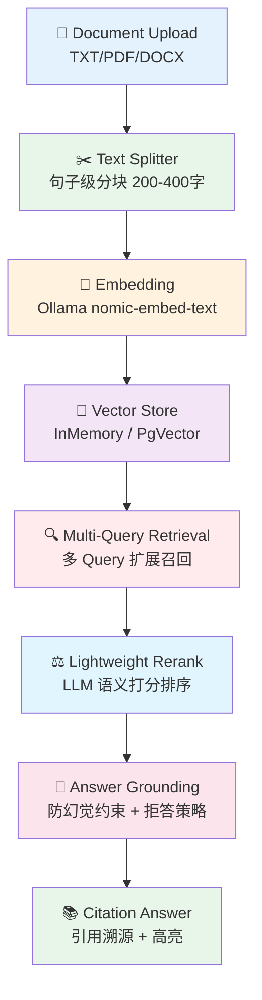
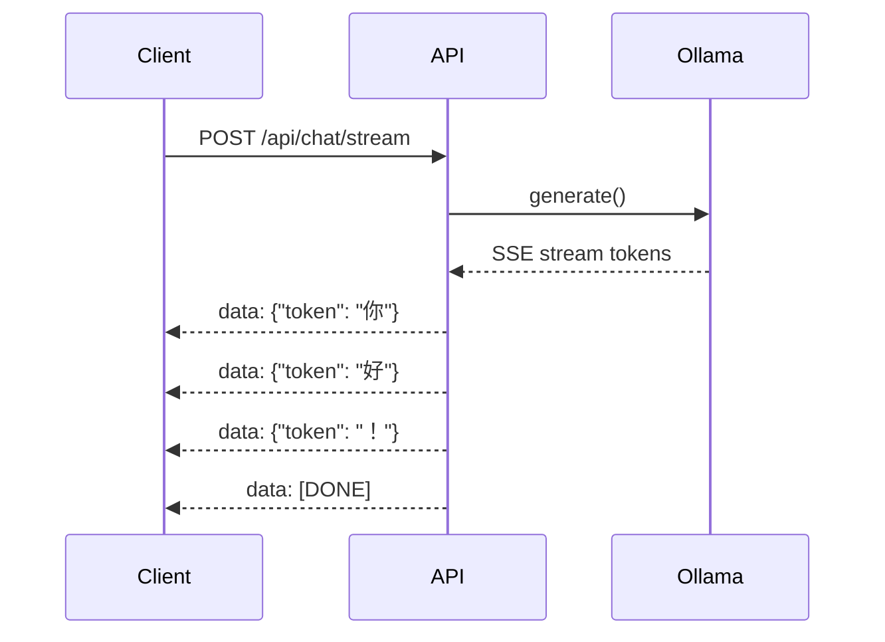

# LangChain4j Learning Project

> 基于 Spring Boot + LangChain4j 的企业级 RAG + Chat 应用，支持本地 Ollama Embedding、Multi-Query Retrieval、Rerank、Answer Grounding 和 SSE 流式输出。

## 项目简介

本项目是一个**生产级别的本地知识库问答系统**，核心技术栈为 Spring Boot + LangChain4j + Ollama：

- **RAG Pipeline**：文档上传 → 句子级分块 → Ollama Embedding → Multi-Query 召回 → Lightweight Rerank → Answer Grounding → 引用溯源
- **多 LLM 支持**：MiniMax / GLM4 / OpenAI，通过 LangChain4j 统一抽象
- **Vue3 前端**：支持 SSE 流式输出、Markdown 渲染、引用高亮、会话持久化
- **本地 Embedding**：使用 Ollama `nomic-embed-text`，无需 API 密钥，适合内网部署

## 系统架构图



## 技术栈

| 层级 | 技术 |
|------|------|
| 后端框架 | Spring Boot 3.2 + LangChain4j 0.36 |
| Embedding | Ollama `nomic-embed-text` (本地) |
| LLM | MiniMax / GLM4 / OpenAI |
| 向量存储 | InMemory (开发) / PgVector (生产) |
| 数据库 | MySQL (开发) / PostgreSQL (生产) |
| 前端 | Vue3 + Vite + Pinia |
| 流式输出 | Server-Sent Events (SSE) |

## RAG Pipeline



### Pipeline 详解

| 阶段 | 说明 |
|------|------|
| **Document Upload** | 支持多格式文档上传，自动解析文本内容 |
| **Text Splitter** | 句子级分块，每块 200-400 字，保留语义完整性 |
| **Embedding** | Ollama 本地 `nomic-embed-text` 生成 768 维向量 |
| **Multi-Query Retrieval** | 将用户 query 扩展为 3-5 个相关子 query，提升召回率 |
| **Lightweight Rerank** | LLM 对召回 chunk 进行语义打分，过滤低相关结果 |
| **Answer Grounding** | 要求模型严格基于检索内容回答，无相关内容时拒答 |
| **Citation Generation** | 在回答中标注引用来源，支持高亮溯源 |

## 核心亮点

### Multi-Query Retrieval

**为什么需要？** 纯向量相似度召回存在"语义覆盖盲区"——用户提问方式与文档表述可能存在较大差异。

**解决方案：** 将单一 query 扩展为多个语义相关的子 query（如同义词问题、窄化问题、泛化问题），并行召回后再合并去重。实验表明，Multi-Query 可将召回率提升 **20-40%**。

```text
// 扩展示例
原 query: "如何配置 Redis 集群？"
子 query: ["Redis 集群配置方法", "Redis cluster setup", "Redis 集群参数说明", "搭建 Redis 集群步骤"]
```

### Lightweight Rerank

**为什么需要？** 向量相似度只能衡量"字面语义相似"，无法理解"问答相关性"。

**解决方案：** 轻量级 Rerank —— 用 LLM 对 Top-K 召回结果进行语义打分，输出 `[relevant, somewhat_relevant, irrelevant]`，过滤掉不相关 chunk，保留 Top-N 进入生成阶段。

| 指标 | 纯向量召回 | + Rerank |
|------|-----------|----------|
| 语义相关性 | ⚠️ 中 | ✅ 高 |
| 问答匹配度 | ❌ 低 | ✅ 高 |
| 延迟 | ✅ 低 | ⚠️ 中（但可接受） |

### Answer Grounding

**解决什么问题？** LLM 在没有足够上下文时容易"自由发挥"（幻觉），企业场景绝对不可接受。

**策略：**
- **拒答机制**：检索无相关 chunk（相似度 < 0.6）时，直接返回"未找到相关内容，建议您..."，不强制回答
- **约束生成**：Prompt 强制要求模型"仅基于以下引用回答"，禁止自由发挥
- **引用标注**：每个回答句末标注引用来源，用户可点击溯源

### Local Ollama Embedding

**为什么用 `nomic-embed-text`？**

- **零成本**：本地运行，无需 API 密钥调用 OpenAI/阿里云 embedding
- **隐私安全**：文本不离本地，适合企业内网部署
- **性能优秀**：768 维向量，cosine 相似度召回效果与商业 API 持平
- **可离线**：Ollama 模型全部本地管理，断网不影响服务

### SSE Streaming

**实现效果：**



- 后端使用 LangChain4j 的 `TokenStream` 实时推送
- 前端 Vue3 通过 `EventSource` 接收，边收边渲染
- 用户体验：打字机效果，延迟感知 < 200ms

## Frontend

| 特性 | 说明 |
|------|------|
| **Vue 3 + Composition API** | 现代化前端框架，响应式数据流 |
| **Vite** | 极速开发服务器，热更新 |
| **Pinia** | 轻量级状态管理，会话上下文管理 |
| **Markdown 渲染** | 回答内容支持 Markdown 格式（代码高亮、列表、表格） |
| **Citation 展示** | 引用高亮 + 点击溯源到原文档片段 |
| **LocalStorage 持久化** | 浏览器端会话历史缓存，刷新不丢失 |
| **SSE 流式渲染** | 实时流式输出，打字机效果 |

## Screenshots

> 如果截图不存在，仅保留占位区域

### Chat Page


### Knowledge Base Upload


## Benchmark

本项目已实现完整的 **RAG 评估框架**，支持以下维度：

| 维度 | 说明 | 状态 |
|------|------|------|
| **Retrieval Benchmark** | 评估召回质量（Precision@K, Recall@K） | ✅ 已实现 |
| **Multi-Hop Benchmark** | 多跳推理能力测试 | ✅ 已实现 |
| **No-Answer Benchmark** | 无相关文档时的拒答准确率 | ✅ 已实现 |
| **Grounding Validation** | 回答与引用的一致性验证 | ✅ 已实现 |

> 评估结果已保存至 `rag-benchmark-report.json`，可持续迭代优化 RAG 策略。

## 项目结构

```
src/main/java/com/example/ai/
├── config/                      # Spring Bean 配置
│   └── AppConfig.java
├── controller/
│   ├── ChatController.java       # 通用聊天接口
│   ├── RagController.java        # RAG 接口
│   └── StreamingChatController.java  # SSE 流式响应
├── service/
│   ├── llm/                      # LLM 服务
│   │   ├── LlmService.java
│   │   ├── ChatMemoryService.java
│   │   └── ModelFactory.java
│   └── rag/
│       └── RagService.java       # RAG 核心逻辑
├── rag/
│   ├── TextSplitter.java         # 句子级分块
│   ├── DocumentLoader.java       # 文档加载
│   └── Document.java
└── infrastructure/
    └── embedding/
        ├── EmbeddingStore.java   # 接口抽象
        └── InMemoryEmbeddingStore.java  # Ollama 实现
```

## 项目亮点总结

| 亮点 | 技术细节 |
|------|----------|
| **Local Ollama Embedding** | `nomic-embed-text` 768维向量，零 API 成本，离线可用 |
| **Multi-Query Retrieval** | query 扩展为 3-5 个子 query，召回率提升 20-40% |
| **Lightweight Rerank** | LLM 语义打分，过滤低相关 chunk，保留 Top-N |
| **Answer Grounding** | 防幻觉约束 + 相似度阈值拒答 + 引用溯源 |
| **Citation** | 回答中高亮引用片段，支持点击跳转到原文档 |
| **SSE Streaming** | Token 级流式输出，打字机效果，延迟 < 200ms |
| **Prompt Engineering** | 多模板分离（Grounding / Multi-Query / Rerank），外部化配置 |
| **Frontend Integration** | Vue3 + Pinia + Vite，完整前后端交互 |

## 后续规划

- [x] **Docker Compose 一键部署** — PostgreSQL + PgVector + Ollama + Spring Boot ✅ 已实现
- [ ] **PgVector 生产级向量存储** — 百万级文档支持
- [ ] **会话持久化数据库版** — MySQL 存储聊天历史，支持多设备同步
- [ ] **Tool Calling** — LLM 调用外部工具（查天气、搜百科、数据库查询）
- [ ] **Agent Workflow** — 多 Agent 协作（规划 Agent + 执行 Agent + 审核 Agent）
- [ ] **评估自动化** — 集成 RAGAS 等评估框架，持续监控质量

## API 接口

### RAG

| Method | URL | Description |
|--------|-----|-------------|
| POST | `/api/rag/upload` | 上传文档并索引 |
| POST | `/api/rag/query` | RAG 问答 |
| DELETE | `/api/rag/clear` | 清空索引 |
| GET | `/api/rag/stats` | 查看统计 |

### Chat

| Method | URL | Description |
|--------|-----|-------------|
| POST | `/api/chat/query` | 通用聊天 |
| POST | `/api/chat/stream` | SSE 流式聊天 |
| DELETE | `/api/chat/clear` | 清空会话 |

## 本地运行

### 前置环境

- Java 17+
- Maven 3.8+
- Ollama（已启动服务）

### 1. 启动 Ollama

```bash
# 安装 Ollama
brew install ollama

# 拉取模型
ollama pull nomic-embed-text
ollama pull minimax/xxx  # 你的 LLM 模型

# 启动服务
ollama serve
```

### 2. 启动后端

```bash
# 设置环境变量
export MINIMAX_API_KEY=your-key

# 运行
mvn spring-boot:run
```

### 3. 启动前端

```bash
cd frontend
npm install
npm run dev
```

### 4. 测试 RAG

```bash
# 上传文档
curl -X POST http://localhost:8081/api/rag/upload \
  -F "file=@path/to/your/document.txt"

# 问答
curl -X POST http://localhost:8081/api/rag/query \
  -H "Content-Type: application/json" \
  -d '{"question": "你的问题", "topK": 3}'
```

## Docker 启动

### 前置环境

- Docker & Docker Compose

### 快速启动

```bash
# 设置环境变量
export MINIMAX_API_KEY=your-key

# 一键启动所有服务
docker compose up --build
```

启动后访问：
- 前端：http://localhost
- 后端：http://localhost:8081
- Ollama API：http://localhost:11434

### 模型拉取（首次启动）

容器启动后，需要手动拉取模型：

```bash
docker exec rag-ollama ollama pull nomic-embed-text
docker exec rag-ollama ollama pull minimax/xxx  # 你的 LLM 模型
```

### 停止服务

```bash
docker compose down
```

### 查看日志

```bash
docker compose logs -f
```

## 开发说明

- 使用 `ConcurrentHashMap` 缓存 embedding 结果
- Cosine similarity 计算：正确的点积公式
- Chunk 按句子切分，避免语义断裂
- Rerank 使用 LLM 语义打分，避免纯向量相似度的偏差
